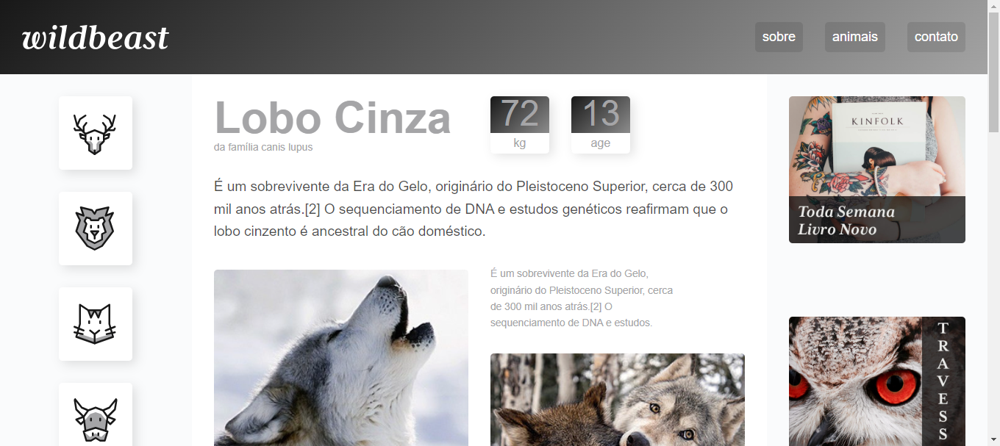

# Wild-Beast Project

- [Wild-Beast Project]()
  - [Visão Geral](#visão-geral)
    - [Desafio](#desafio)
- [Screenshot](#screenshot)
    - [Desktop](#desktop)
    - [Links](#links)
- [Tecnologias utilizadas](#tecnologias-utilizadas)
    - [Composição do projeto](#composição-do-projeto)
    - [Autor](#autor)

## Visão Geral
****
### Desafio

Os usuários devem ser capazes de:

- Visualizar o layout ideal dependendo do tamanho da tela do dispositivo.
- Alteração das cores
- Ajustes nas Midias Query

# Screenshot

### Desktop

### Links

- Solução URL: [Repositório](https://github.com/Lucs25/Wild-Beast.git)
- Live Site URL: [Site](https://wild-beast-zeta.vercel.app/)

# Tecnologias utilizadas:

  

### Composição do projeto:

- Semantic HTML5 markup
- CSS custom properties
- Flexbox
- Grid
- Javascript

### Autor:

Lucas Ray
